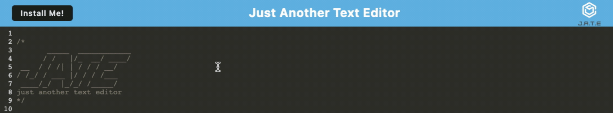

# TxT | Editor

## Description

<strong>T</strong>x<strong>T</strong> <strong>Editor</strong> is a Progressive Web Application that runs in the browser and offline. The app was developed to assist in creating notes or code snippets with or without an internet connection, so that users can reliably retrieve them for later use.

## Table of Contents

- [Description](#description)
- [Demo](#demo)
- [Testing](#test)
- [License](#license)
- [Tech Stack](#technologies)
- [Feedback](#feedback)

 

## Demo

### Live Deployment Screenshot:

 

## Test

    – To test and use the app on your local machine follow the instructions:
        • Clone the repository
        • Ensure you are in the project directory
        • Run "npm i" or "npm install" to install the required packages
        • Run "npm start" and open the app in the browser
        
### Live Deployment:
If you prefer you can also test the app by [CLICKING HERE](https://txting-editor.herokuapp.com) to access it.

## License

This project is licensed under the MIT License.

## Technologies

    – Webpack
    – idb
    – Workbox
    – express

## Feedback

GitHub: [github.com/rfabreu](https://github.com/rfabreu)  
Comments, suggestions, questions? Contact me at: [rafael.gomes@mail.utoronto.ca](mailto:rafael.gomes@mail.utoronto.ca)  
Use the App: [TxT | Editor](https://txting-editor.herokuapp.com)